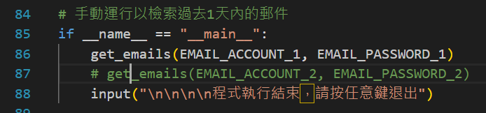
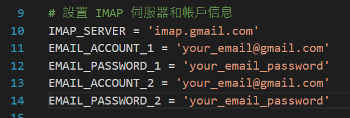

# EmailReceiver
一個能夠接收 google email 郵件的程式，並透過套件達到每日於固定時間發送郵件給使用者之功能。

```
pip install pytz pyinstaller
```

# Implementation Steps
### 下載程式碼


### 更動程式碼


```
pyinstaller --onefile --console emailReceiver.py
```

# Reference
chatGPT\
[【中英字幕】使用 Python 从您的 Gmail 收件箱中提取电子邮件](https://www.bilibili.com/video/BV1M3411j7zN/) 2:40~3:10
