# EmailReceiver
一個能夠接收 google email 郵件的程式，並透過套件達到每日於固定時間發送郵件給使用者之功能。\
動機 : 因為我的 email 不知道為什麼，在別人寄信過來的時候，就是收不到訊息，所有設定都點過一遍，卻都沒有結果，讓我很困擾。(如果有高人指點是再好不過了)

```
pip install pytz pyinstaller
```

# Implementation Steps
## 下載程式碼
<kbd>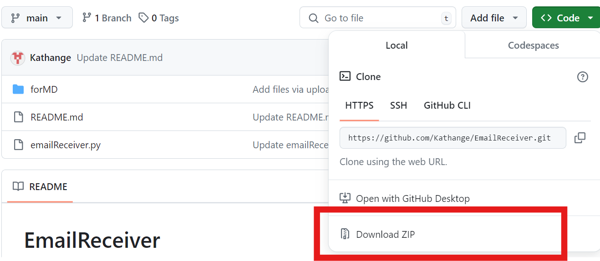</kbd>

## 更動程式碼
因為我有兩個常用 email，所以設定了兩組 email 與 email password，可自行調整或註解第二組 email。\
<kbd></kbd>\
此處亦須調整\
<kbd></kbd>

## Gmail 設定
點選右上角齒輪，並點擊 "查看所有設定"。\
<kbd>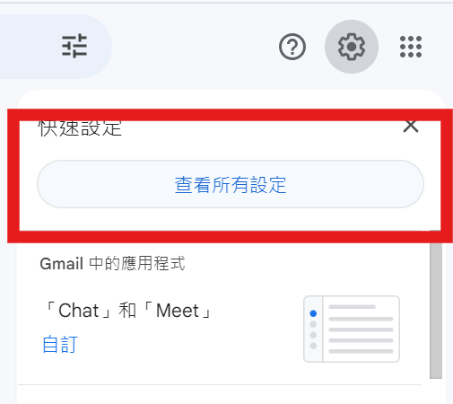</kbd>\
啟用 IMAP\
<kbd>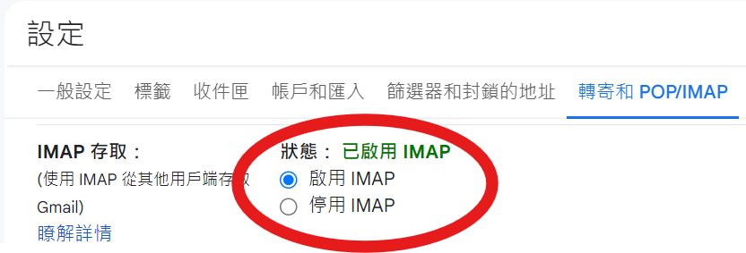</kbd>

## google 帳戶設定
進入帳戶的設定之後，點擊 "安全性"，進入 "兩步驟驗證"\
<kbd>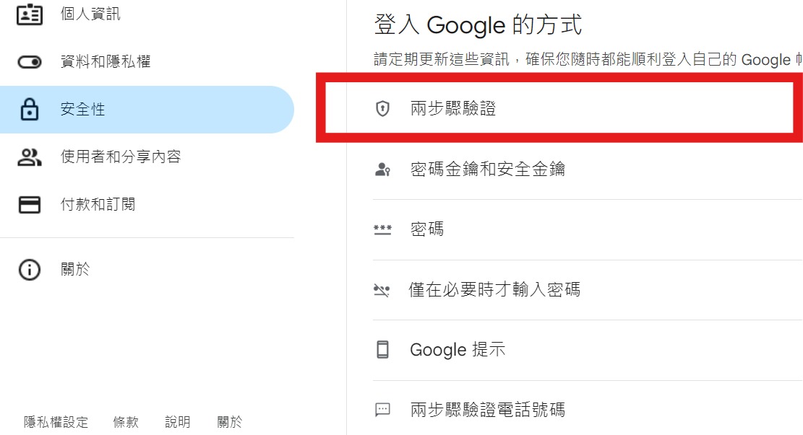</kbd>\
頁面最下方就有 "應用程式密碼"\
<kbd>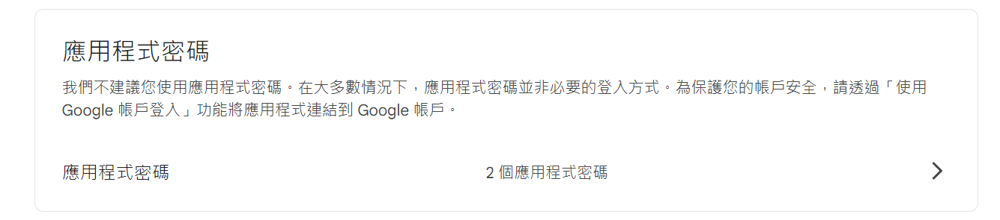</kbd>\
創建一個新密碼\
<kbd>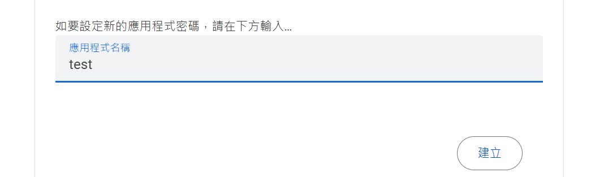</kbd>\
將產生 16 位應用程式密碼，這就是程式碼中 "EMAIL_PASSWORD"\
<kbd>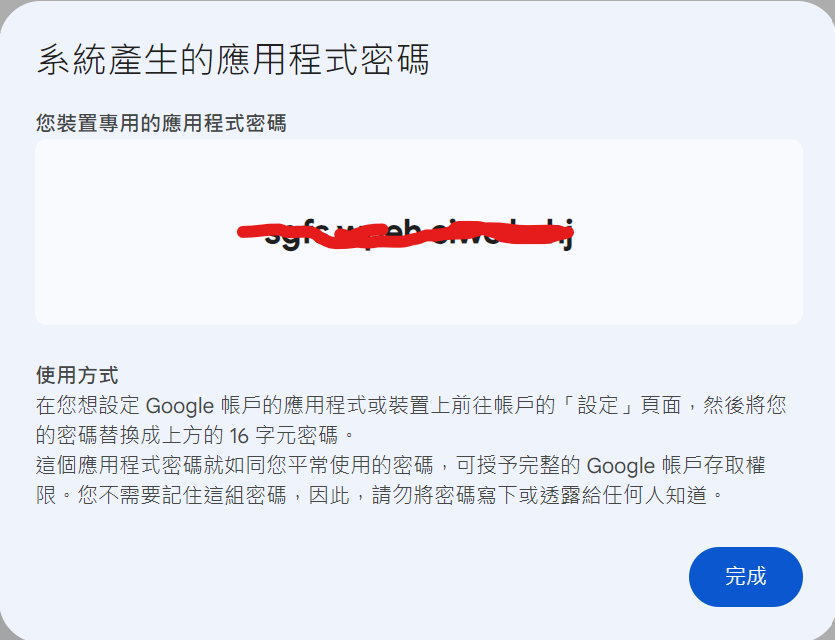</kbd>\
如果沒申請過密碼，那...我也不知道要去哪裡找到它，直接用搜尋的最快嘿嘿\
<kbd>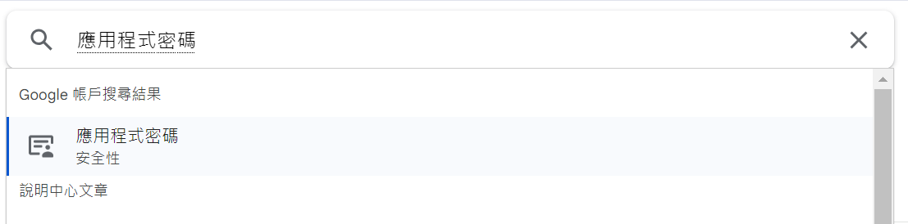</kbd>

## 打包成執行檔
在 terminal 輸入指令，將會開始生成執行檔
```
pyinstaller --onefile --console emailReceiver.py
```
會創建兩個資料夾跟一個檔案，執行檔位在 dist 中\
<kbd>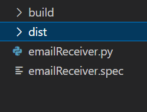</kbd>

## windows 工作排成器
照著步驟走就能創建一個工作\
<kbd>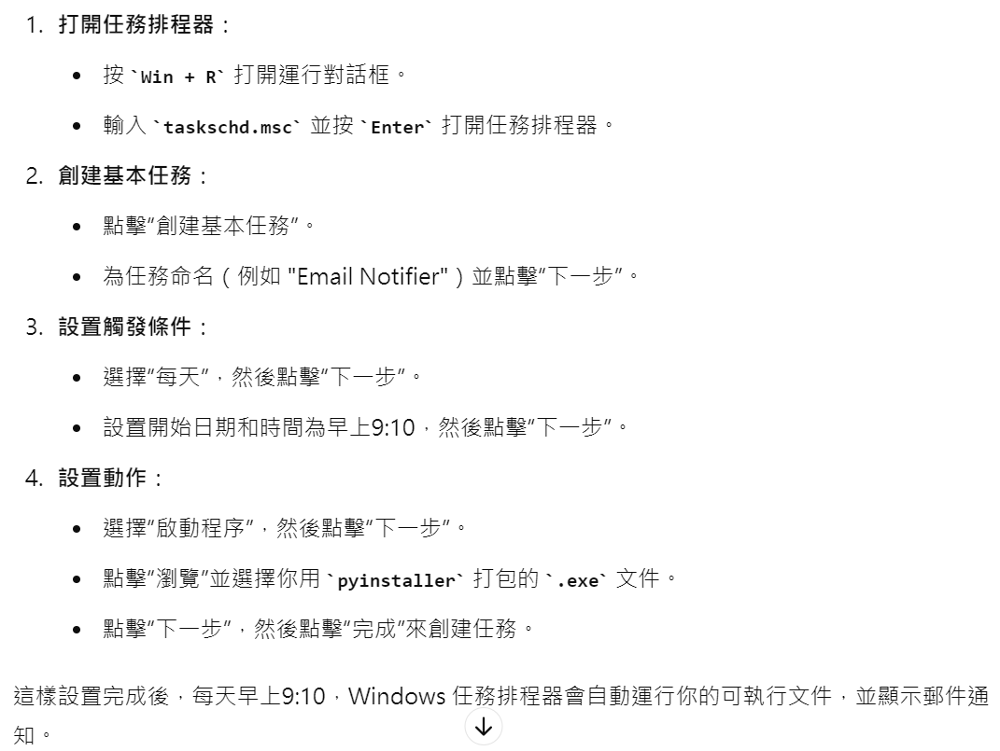</kbd>\
點選 "工作排成器程式庫" 就能找到剛剛創建的工作\
<kbd>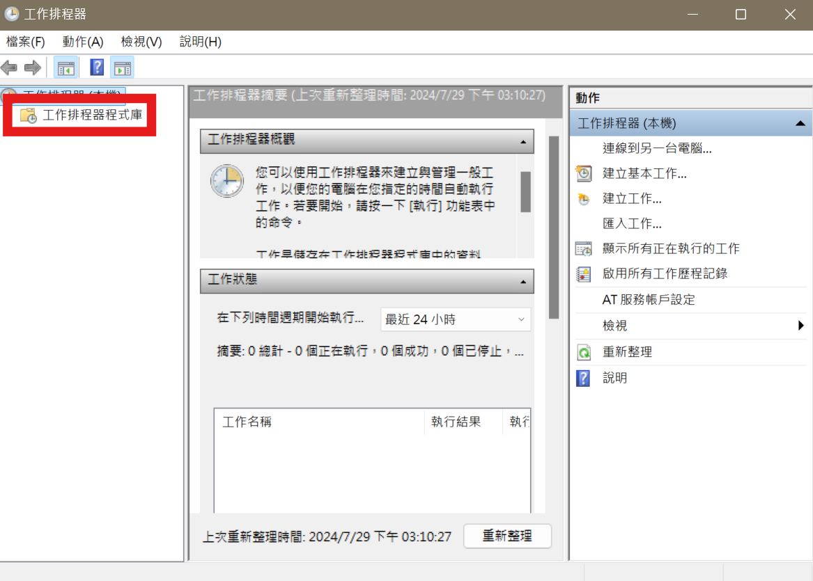</kbd>

# Reference
chatGPT\
[【中英字幕】使用 Python 从您的 Gmail 收件箱中提取电子邮件](https://www.bilibili.com/video/BV1M3411j7zN/) 2:40~3:10
